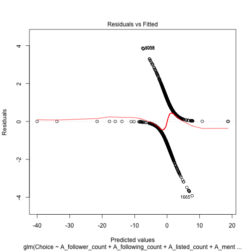
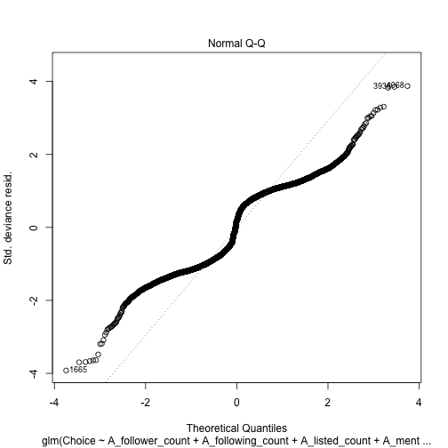
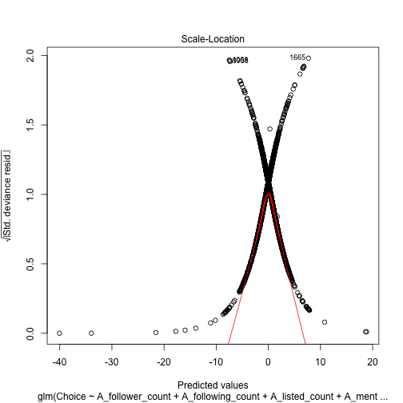
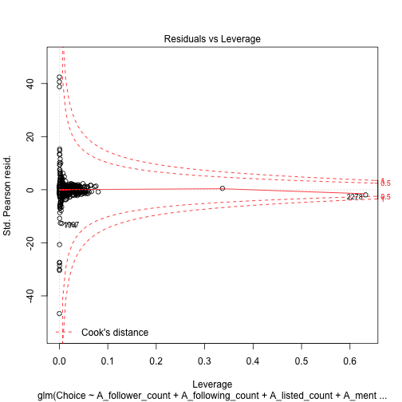

Creating a logistic regression model from the Kaggle data
========================================================

Modeling the approach detailed here: http://www.ats.ucla.edu/stat/r/dae/logit.htm

Let's load in the data:


```r
library(aod)
```

```
## Warning: package 'aod' was built under R version 3.0.2
```

```r
library(ggplot2)
```

```
## Warning: package 'ggplot2' was built under R version 3.0.2
```

```r
train <- read.csv("~/Code/kaggle_class_code/train.csv")
test <- read.csv("~/Code/kaggle_class_code/test.csv")
```


Let's get a summary of our training set data:


```r
summary(train)
```

```
##      Choice      A_follower_count   A_following_count A_listed_count  
##  Min.   :0.000   Min.   :      16   Min.   :      0   Min.   :     0  
##  1st Qu.:0.000   1st Qu.:    2664   1st Qu.:    322   1st Qu.:    85  
##  Median :1.000   Median :   45589   Median :    778   Median :   932  
##  Mean   :0.509   Mean   :  649884   Mean   :  12659   Mean   :  5952  
##  3rd Qu.:1.000   3rd Qu.:  392738   3rd Qu.:   2838   3rd Qu.:  6734  
##  Max.   :1.000   Max.   :36543194   Max.   :1165830   Max.   :549144  
##  A_mentions_received A_retweets_received A_mentions_sent A_retweets_sent 
##  Min.   :      0     Min.   :     0      Min.   : 0.10   Min.   : 0.101  
##  1st Qu.:      3     1st Qu.:     1      1st Qu.: 0.36   1st Qu.: 0.101  
##  Median :     49     Median :    14      Median : 2.30   Median : 0.342  
##  Mean   :   2666     Mean   :  1032      Mean   : 6.01   Mean   : 1.110  
##  3rd Qu.:    350     3rd Qu.:   119      3rd Qu.: 7.20   3rd Qu.: 1.321  
##  Max.   :1145219     Max.   :435826      Max.   :76.81   Max.   :16.291  
##     A_posts       A_network_feature_1 A_network_feature_2
##  Min.   :  0.10   Min.   :     0      Min.   :   0.0     
##  1st Qu.:  0.63   1st Qu.:    12      1st Qu.:  15.0     
##  Median :  3.56   Median :   195      Median :  54.9     
##  Mean   :  9.09   Mean   :  5268      Mean   :  84.8     
##  3rd Qu.: 10.69   3rd Qu.:  1323      3rd Qu.: 109.7     
##  Max.   :193.07   Max.   :920838      Max.   :1121.0     
##  A_network_feature_3 B_follower_count   B_following_count B_listed_count  
##  Min.   :     0      Min.   :      20   Min.   :     0    Min.   :     0  
##  1st Qu.:  1181      1st Qu.:    2498   1st Qu.:   322    1st Qu.:    75  
##  Median :  2206      Median :   44027   Median :   773    Median :   890  
##  Mean   :  3747      Mean   :  685487   Mean   : 12738    Mean   :  5903  
##  3rd Qu.:  4390      3rd Qu.:  370114   3rd Qu.:  2838    3rd Qu.:  6734  
##  Max.   :144651      Max.   :36543194   Max.   :664324    Max.   :549144  
##  B_mentions_received B_retweets_received B_mentions_sent B_retweets_sent 
##  Min.   :      0     Min.   :     0      Min.   : 0.10   Min.   : 0.101  
##  1st Qu.:      3     1st Qu.:     1      1st Qu.: 0.36   1st Qu.: 0.101  
##  Median :     49     Median :    14      Median : 2.25   Median : 0.342  
##  Mean   :   2555     Mean   :   997      Mean   : 6.10   Mean   : 1.106  
##  3rd Qu.:    374     3rd Qu.:   107      3rd Qu.: 6.87   3rd Qu.: 1.321  
##  Max.   :1145219     Max.   :435826      Max.   :76.81   Max.   :16.291  
##     B_posts       B_network_feature_1 B_network_feature_2
##  Min.   :  0.10   Min.   :     0      Min.   :   0.0     
##  1st Qu.:  0.82   1st Qu.:    11      1st Qu.:  15.2     
##  Median :  3.34   Median :   190      Median :  54.9     
##  Mean   :  9.51   Mean   :  5255      Mean   :  85.0     
##  3rd Qu.: 10.60   3rd Qu.:  1323      3rd Qu.: 112.2     
##  Max.   :193.07   Max.   :920838      Max.   :1861.6     
##  B_network_feature_3
##  Min.   :    0      
##  1st Qu.: 1206      
##  Median : 2206      
##  Mean   : 3745      
##  3rd Qu.: 4350      
##  Max.   :75526
```


There seem to be an even amount of influencers and non-influencers in this data. This may suggest that the data has been curated to be proportional. The max values are really high for some of the variables, suggesting that either people have too much time to spend on Twitter, or that they've automated their Twitter activities.


```r
sapply(train, sd)
```

```
##              Choice    A_follower_count   A_following_count 
##           5.000e-01           2.029e+06           4.901e+04 
##      A_listed_count A_mentions_received A_retweets_received 
##           1.734e+04           2.917e+04           1.095e+04 
##     A_mentions_sent     A_retweets_sent             A_posts 
##           9.520e+00           1.910e+00           1.831e+01 
## A_network_feature_1 A_network_feature_2 A_network_feature_3 
##           2.895e+04           1.041e+02           5.757e+03 
##    B_follower_count   B_following_count      B_listed_count 
##           2.161e+06           5.005e+04           1.630e+04 
## B_mentions_received B_retweets_received     B_mentions_sent 
##           2.509e+04           9.342e+03           9.730e+00 
##     B_retweets_sent             B_posts B_network_feature_1 
##           1.940e+00           1.942e+01           2.678e+04 
## B_network_feature_2 B_network_feature_3 
##           1.067e+02           5.518e+03
```


Of course, the standard deviation is pretty high for all variables. We definitely have outliers in this dataset. So maybe an algorithm more sensitive to outliers is best suited for a model based on this data.

Let's make a contingency table:


```r
xtabs(~Choice + A_network_feature_1, data = train)
```

```
##       A_network_feature_1
## Choice   0   1   2   3   4   5   6   7   8   9  10  11  12  13  14  15  16
##      0 184 218 192  65  60  67  53  28  21  71  32  44  42   5  16  31  19
##      1  28  50  69  34  28  16  14   8  13  20  19  22  15   2  11  19   8
##       A_network_feature_1
## Choice  17  18  19  20  21  22  23  24  25  26  27  28  29  30  31  32  33
##      0  16  37   2   2  24  22   3   3  13   2   1  19  27  14   3  29   1
##      1   6  25   2   2  16   8   2   2   2   1   1   6  13   6   4  12   1
##       A_network_feature_1
## Choice  34  35  36  37  38  39  40  41  42  44  45  46  47  49  50  51  52
##      0  19  19  17   0   2   3  17   0  24   0   1   0   7   0   8  10  28
##      1   6   3   7   2   1   4  24   1  10   2   0   1  17   1  10   3   9
##       A_network_feature_1
## Choice  54  55  56  58  59  60  61  63  65  66  67  68  69  72  75  76  77
##      0  24   2   1   1   0  31  13   0   1  26   1   9   5   1   1   0   0
##      1   4   0   1   0   1  22  11   2   1  14   0  11  18   0   0   1   1
##       A_network_feature_1
## Choice  79  81  82  83  84  85  87  90  92  93  94  95  97 101 102 103 105
##      0   1   1   0   1   1  11   2   2   9   0   0  22   0   0   0   1   1
##      1   0   0   2   0   1  10   2   0  11   1   1  14   1   1   2   0   1
##       A_network_feature_1
## Choice 106 107 108 109 110 111 113 115 116 119 120 121 122 125 126 127 128
##      0   1   2   1   1   2  19   8   0  10   0   0   0  13   0  10   1   9
##      1   1   3   3   0   1   6  13   2   9   1   1   1  15   1  12   1  10
##       A_network_feature_1
## Choice 131 135 137 142 144 147 150 151 157 163 164 168 170 172 177 185 188
##      0   1   1   0   1   2  18   0   1  11   5   1  12   4   0   7   0   2
##      1   0   0   3   0   0   0   1   0   7  12   0  30  16   1  12   1  11
##       A_network_feature_1
## Choice 190 192 193 195 196 198 200 202 203 206 207 211 214 216 219 221 222
##      0   6   1   0  10   1   1   0  12   9  11   8  13   1   0   7   0   1
##      1   8   0   1   2   0   0   1  15   7  13  11  11   0   1  19   1   0
##       A_network_feature_1
## Choice 226 227 228 229 230 232 236 239 240 242 252 255 266 271 284 288 294
##      0  11   1  15   7   9   1   1  11   0   0   0   0   0  13   1   2   0
##      1   9   0   8  12   5   0   0  10   1   1   2   2   1   9   0  19   1
##       A_network_feature_1
## Choice 296 307 312 319 322 324 336 342 350 351 355 356 369 371 378 383 390
##      0   9   6   5   0   2   0   0   0   4   5   6   0   7   0  12   0   9
##      1  12  18  20   1  12   3   2   2   8  13  20   1  11   1  14   1  12
##       A_network_feature_1
## Choice 395 404 405 430 432 434 441 454 466 468 485 503 534 542 551 562 567
##      0   0   0   1   6   4   1  11   5  26   0   0   0   1   6  10  10   8
##      1   1   1   0  17  14   0   5  16  21   1   1   1   1  18  13  17  13
##       A_network_feature_1
## Choice 568 578 599 600 642 669 679 682 683 688 690 696 707 728 758 764 768
##      0  11   9  15  12   1   4   4   5   8   6   4   1   0   8   5   3   0
##      1  24  13  10   8   1  10  19  14  12  18  25  18   1  11   5  12   1
##       A_network_feature_1
## Choice 791 797 804 809 824 847 852 871 887 890 894 921 928 948 973 997
##      0  14   0   4   1   0   0   6   8   2  10   4   0   3   1   8   0
##      1  30   1  15   0   1   1  11  16  12  20  17   1  11   0  19  11
##       A_network_feature_1
## Choice 1027 1035 1063 1085 1093 1201 1280 1323 1330 1359 1458 1539 1541
##      0    0    1    8    0    8    4    5    4    8    4    0    3    1
##      1    1    0   17    1   14   21   14   27    8   13    1   17    0
##       A_network_feature_1
## Choice 1690 1706 1732 1740 1743 1762 1793 1794 1796 1816 1881 1917 2021
##      0    0    8    5    0    9   10    2    0    6    0    3    5    5
##      1    1   18    0    1   13   11   19    1   19    1    3   13   14
##       A_network_feature_1
## Choice 2035 2164 2174 2264 2302 2330 2335 2376 2380 2391 2536 2597 2603
##      0    1    1    1    0    1    0   11    2    0    2    4    3    7
##      1    0    4    1    1   17    1   12   19    1    1   16   16   17
##       A_network_feature_1
## Choice 2617 2638 2662 2689 2737 2749 2760 2767 3048 3063 3166 3307 3366
##      0    0    3    0    1    1    0    1    6    3    1    3   16    1
##      1    1    0    1   15    1    1    0   19   14    1   12    7   12
##       A_network_feature_1
## Choice 3434 3450 3641 3682 3691 3918 3999 4027 4067 4209 4476 4484 4801
##      0    2    6    3    1    3   11    4    3    6    1    0    1    9
##      1    0   18   14    3   14   13   11   14   14    0    2    0    9
##       A_network_feature_1
## Choice 4843 4951 4970 5210 5373 5748 5759 5950 6261 6867 6986 7094 7321
##      0    0    4    4    3    0    3    8    1    3    4    4    0    1
##      1    1    2   21   13    1    2   15    3   23   21    2    1   11
##       A_network_feature_1
## Choice 7855 7979 8003 8550 9162 9335 9896 10560 10885 10953 11065 12203
##      0    0    3    1    3    2    0    1     8     3     9     0     4
##      1    2    2    1   14    0    1   18    19     2    10     1    22
##       A_network_feature_1
## Choice 12252 12453 12810 13291 13774 14107 14301 14899 15030 15102 16646
##      0     3     4     0     2     0     3     1     1     0     8     4
##      1    14    19     1     1     2     0     2     0     1    11    12
##       A_network_feature_1
## Choice 18549 20125 20589 21678 21964 23939 23958 25313 28564 28917 32871
##      0    10     1     1     4     2     8    10     3     1     2     3
##      1    12     1     2    14    18     7    13    17    15     0     0
##       A_network_feature_1
## Choice 35306 35645 46906 52580 54819 56196 58691 61013 61842 88154 187674
##      0     0     3     6     3     0     9     0     4     1     2      6
##      1     1    17    19    34     2    13     2    15    13    18     12
##       A_network_feature_1
## Choice 213718 920838
##      0      8      2
##      1     12      1
```


After playing with some formulas, my initial poking around makes me think the unnamed variables have the biggest impact on this data. Unfortunately, I don't know what those are...

But anyhow, let's make a logistic regression model (and generate a baseline for us to compare our future models to). Everything in our dataset seems to be numeric and continuous:


```r
mylogit <- glm(Choice ~ A_follower_count + A_following_count + A_listed_count + 
    A_mentions_received + A_retweets_received + A_mentions_sent + A_retweets_sent + 
    A_posts + A_network_feature_1 + A_network_feature_2 + A_network_feature_3 + 
    B_follower_count + B_following_count + B_listed_count + B_mentions_received + 
    B_retweets_received + B_mentions_sent + B_retweets_sent + B_posts + B_network_feature_1 + 
    B_network_feature_2 + B_network_feature_3, data = train, family = "binomial")
```

```
## Warning: glm.fit: fitted probabilities numerically 0 or 1 occurred
```

```r

summary(mylogit)
```

```
## 
## Call:
## glm(formula = Choice ~ A_follower_count + A_following_count + 
##     A_listed_count + A_mentions_received + A_retweets_received + 
##     A_mentions_sent + A_retweets_sent + A_posts + A_network_feature_1 + 
##     A_network_feature_2 + A_network_feature_3 + B_follower_count + 
##     B_following_count + B_listed_count + B_mentions_received + 
##     B_retweets_received + B_mentions_sent + B_retweets_sent + 
##     B_posts + B_network_feature_1 + B_network_feature_2 + B_network_feature_3, 
##     family = "binomial", data = train)
## 
## Deviance Residuals: 
##    Min      1Q  Median      3Q     Max  
## -3.921  -0.997   0.187   0.975   3.872  
## 
## Coefficients:
##                      Estimate Std. Error z value Pr(>|z|)    
## (Intercept)          8.39e-02   5.97e-02    1.41  0.16002    
## A_follower_count    -1.60e-07   4.31e-08   -3.71  0.00020 ***
## A_following_count    1.67e-06   7.76e-07    2.16  0.03116 *  
## A_listed_count       9.77e-05   6.56e-06   14.89  < 2e-16 ***
## A_mentions_received -1.16e-05   8.43e-06   -1.37  0.17045    
## A_retweets_received -1.71e-04   2.55e-05   -6.72  1.8e-11 ***
## A_mentions_sent      9.81e-03   5.04e-03    1.95  0.05140 .  
## A_retweets_sent      7.80e-02   2.48e-02    3.14  0.00168 ** 
## A_posts              3.44e-03   2.50e-03    1.38  0.16841    
## A_network_feature_1  4.78e-05   4.43e-06   10.78  < 2e-16 ***
## A_network_feature_2  1.10e-03   3.59e-04    3.06  0.00224 ** 
## A_network_feature_3  3.01e-05   6.96e-06    4.32  1.5e-05 ***
## B_follower_count     1.45e-07   4.06e-08    3.58  0.00035 ***
## B_following_count   -4.20e-07   7.34e-07   -0.57  0.56735    
## B_listed_count      -1.09e-04   6.85e-06  -15.96  < 2e-16 ***
## B_mentions_received  1.63e-06   8.67e-06    0.19  0.85046    
## B_retweets_received  8.34e-05   4.23e-05    1.97  0.04868 *  
## B_mentions_sent     -1.23e-02   4.59e-03   -2.67  0.00747 ** 
## B_retweets_sent     -1.25e-01   2.51e-02   -4.99  6.0e-07 ***
## B_posts             -5.25e-04   2.10e-03   -0.25  0.80228    
## B_network_feature_1 -2.57e-05   8.18e-06   -3.15  0.00164 ** 
## B_network_feature_2 -8.23e-04   3.54e-04   -2.33  0.02007 *  
## B_network_feature_3 -3.03e-05   6.93e-06   -4.37  1.2e-05 ***
## ---
## Signif. codes:  0 '***' 0.001 '**' 0.01 '*' 0.05 '.' 0.1 ' ' 1
## 
## (Dispersion parameter for binomial family taken to be 1)
## 
##     Null deviance: 7622.7  on 5499  degrees of freedom
## Residual deviance: 6272.9  on 5477  degrees of freedom
## AIC: 6319
## 
## Number of Fisher Scoring iterations: 6
```


Off of the bat, some variables seem more important than others (in terms of weightage in the model). Specifically, A_listed_count, A_mentions_sent, B_retweets_received, etc. The magnitude of the data seems to differ among variables--we should probably use log to make things less turbulent. However, none of this means anything yet...

Let's make some confidence intervals:

```r
# confint(mylogit)
confint.default(mylogit)  #this will make CIs using standard error
```

```
##                          2.5 %     97.5 %
## (Intercept)         -3.315e-02  2.010e-01
## A_follower_count    -2.444e-07 -7.558e-08
## A_following_count    1.515e-07  3.195e-06
## A_listed_count       8.487e-05  1.106e-04
## A_mentions_received -2.808e-05  4.967e-06
## A_retweets_received -2.213e-04 -1.214e-04
## A_mentions_sent     -5.979e-05  1.968e-02
## A_retweets_sent      2.935e-02  1.267e-01
## A_posts             -1.456e-03  8.340e-03
## A_network_feature_1  3.911e-05  5.649e-05
## A_network_feature_2  3.935e-04  1.800e-03
## A_network_feature_3  1.644e-05  4.372e-05
## B_follower_count     6.574e-08  2.250e-07
## B_following_count   -1.858e-06  1.018e-06
## B_listed_count      -1.228e-04 -9.594e-05
## B_mentions_received -1.536e-05  1.863e-05
## B_retweets_received  4.839e-07  1.664e-04
## B_mentions_sent     -2.128e-02 -3.282e-03
## B_retweets_sent     -1.743e-01 -7.602e-02
## B_posts             -4.634e-03  3.584e-03
## B_network_feature_1 -4.177e-05 -9.717e-06
## B_network_feature_2 -1.516e-03 -1.292e-04
## B_network_feature_3 -4.389e-05 -1.671e-05
```


Can we figure out the overall effect of rank using a wald test?:


```r
wald.test(b = coef(mylogit), Sigma = vcov(mylogit), Terms = 1:23)
```

```
## Wald test:
## ----------
## 
## Chi-squared test:
## X2 = 793.7, df = 23, P(> X2) = 0.0
```


Wow. Pretty significant. Maybe I'm doing this wrong. But let's power through...

Let's get some odds ratios (and their 95% CIs):

```r
exp(cbind(OR = coef(mylogit), confint(mylogit)))
```

```
## Waiting for profiling to be done...
```

```
## Warning: glm.fit: fitted probabilities numerically 0 or 1 occurred
```

```
## Warning: glm.fit: fitted probabilities numerically 0 or 1 occurred
```

```
## Warning: glm.fit: fitted probabilities numerically 0 or 1 occurred
```

```
## Warning: glm.fit: fitted probabilities numerically 0 or 1 occurred
```

```
## Warning: glm.fit: fitted probabilities numerically 0 or 1 occurred
```

```
## Warning: glm.fit: fitted probabilities numerically 0 or 1 occurred
```

```
## Warning: glm.fit: fitted probabilities numerically 0 or 1 occurred
```

```
## Warning: glm.fit: fitted probabilities numerically 0 or 1 occurred
```

```
## Warning: glm.fit: fitted probabilities numerically 0 or 1 occurred
```

```
## Warning: glm.fit: fitted probabilities numerically 0 or 1 occurred
```

```
## Warning: glm.fit: fitted probabilities numerically 0 or 1 occurred
```

```
## Warning: glm.fit: fitted probabilities numerically 0 or 1 occurred
```

```
## Warning: glm.fit: fitted probabilities numerically 0 or 1 occurred
```

```
## Warning: glm.fit: fitted probabilities numerically 0 or 1 occurred
```

```
## Warning: glm.fit: fitted probabilities numerically 0 or 1 occurred
```

```
## Warning: glm.fit: fitted probabilities numerically 0 or 1 occurred
```

```
## Warning: glm.fit: fitted probabilities numerically 0 or 1 occurred
```

```
## Warning: glm.fit: fitted probabilities numerically 0 or 1 occurred
```

```
## Warning: glm.fit: fitted probabilities numerically 0 or 1 occurred
```

```
## Warning: glm.fit: fitted probabilities numerically 0 or 1 occurred
```

```
## Warning: glm.fit: fitted probabilities numerically 0 or 1 occurred
```

```
## Warning: glm.fit: fitted probabilities numerically 0 or 1 occurred
```

```
## Warning: glm.fit: fitted probabilities numerically 0 or 1 occurred
```

```
## Warning: glm.fit: fitted probabilities numerically 0 or 1 occurred
```

```
## Warning: glm.fit: fitted probabilities numerically 0 or 1 occurred
```

```
## Warning: glm.fit: fitted probabilities numerically 0 or 1 occurred
```

```
## Warning: glm.fit: fitted probabilities numerically 0 or 1 occurred
```

```
## Warning: glm.fit: fitted probabilities numerically 0 or 1 occurred
```

```
## Warning: glm.fit: fitted probabilities numerically 0 or 1 occurred
```

```
## Warning: glm.fit: fitted probabilities numerically 0 or 1 occurred
```

```
## Warning: glm.fit: fitted probabilities numerically 0 or 1 occurred
```

```
## Warning: glm.fit: fitted probabilities numerically 0 or 1 occurred
```

```
## Warning: glm.fit: fitted probabilities numerically 0 or 1 occurred
```

```
## Warning: glm.fit: fitted probabilities numerically 0 or 1 occurred
```

```
## Warning: glm.fit: fitted probabilities numerically 0 or 1 occurred
```

```
## Warning: glm.fit: fitted probabilities numerically 0 or 1 occurred
```

```
## Warning: glm.fit: fitted probabilities numerically 0 or 1 occurred
```

```
## Warning: glm.fit: fitted probabilities numerically 0 or 1 occurred
```

```
## Warning: glm.fit: fitted probabilities numerically 0 or 1 occurred
```

```
## Warning: glm.fit: fitted probabilities numerically 0 or 1 occurred
```

```
## Warning: glm.fit: fitted probabilities numerically 0 or 1 occurred
```

```
## Warning: glm.fit: fitted probabilities numerically 0 or 1 occurred
```

```
## Warning: glm.fit: fitted probabilities numerically 0 or 1 occurred
```

```
## Warning: glm.fit: fitted probabilities numerically 0 or 1 occurred
```

```
## Warning: glm.fit: fitted probabilities numerically 0 or 1 occurred
```

```
## Warning: glm.fit: fitted probabilities numerically 0 or 1 occurred
```

```
## Warning: glm.fit: fitted probabilities numerically 0 or 1 occurred
```

```
## Warning: glm.fit: fitted probabilities numerically 0 or 1 occurred
```

```
## Warning: glm.fit: fitted probabilities numerically 0 or 1 occurred
```

```
## Warning: glm.fit: fitted probabilities numerically 0 or 1 occurred
```

```
## Warning: glm.fit: fitted probabilities numerically 0 or 1 occurred
```

```
## Warning: glm.fit: fitted probabilities numerically 0 or 1 occurred
```

```
## Warning: glm.fit: fitted probabilities numerically 0 or 1 occurred
```

```
## Warning: glm.fit: fitted probabilities numerically 0 or 1 occurred
```

```
## Warning: glm.fit: fitted probabilities numerically 0 or 1 occurred
```

```
## Warning: glm.fit: fitted probabilities numerically 0 or 1 occurred
```

```
## Warning: glm.fit: fitted probabilities numerically 0 or 1 occurred
```

```
## Warning: glm.fit: fitted probabilities numerically 0 or 1 occurred
```

```
## Warning: glm.fit: fitted probabilities numerically 0 or 1 occurred
```

```
## Warning: glm.fit: fitted probabilities numerically 0 or 1 occurred
```

```
## Warning: glm.fit: fitted probabilities numerically 0 or 1 occurred
```

```
## Warning: glm.fit: fitted probabilities numerically 0 or 1 occurred
```

```
## Warning: glm.fit: fitted probabilities numerically 0 or 1 occurred
```

```
## Warning: glm.fit: fitted probabilities numerically 0 or 1 occurred
```

```
## Warning: glm.fit: fitted probabilities numerically 0 or 1 occurred
```

```
## Warning: glm.fit: fitted probabilities numerically 0 or 1 occurred
```

```
## Warning: glm.fit: fitted probabilities numerically 0 or 1 occurred
```

```
## Warning: glm.fit: fitted probabilities numerically 0 or 1 occurred
```

```
## Warning: glm.fit: fitted probabilities numerically 0 or 1 occurred
```

```
## Warning: glm.fit: fitted probabilities numerically 0 or 1 occurred
```

```
## Warning: glm.fit: fitted probabilities numerically 0 or 1 occurred
```

```
## Warning: glm.fit: fitted probabilities numerically 0 or 1 occurred
```

```
## Warning: glm.fit: fitted probabilities numerically 0 or 1 occurred
```

```
## Warning: glm.fit: fitted probabilities numerically 0 or 1 occurred
```

```
## Warning: glm.fit: fitted probabilities numerically 0 or 1 occurred
```

```
## Warning: glm.fit: fitted probabilities numerically 0 or 1 occurred
```

```
## Warning: glm.fit: fitted probabilities numerically 0 or 1 occurred
```

```
## Warning: glm.fit: fitted probabilities numerically 0 or 1 occurred
```

```
## Warning: glm.fit: fitted probabilities numerically 0 or 1 occurred
```

```
## Warning: glm.fit: fitted probabilities numerically 0 or 1 occurred
```

```
## Warning: glm.fit: fitted probabilities numerically 0 or 1 occurred
```

```
## Warning: glm.fit: fitted probabilities numerically 0 or 1 occurred
```

```
## Warning: glm.fit: fitted probabilities numerically 0 or 1 occurred
```

```
## Warning: glm.fit: fitted probabilities numerically 0 or 1 occurred
```

```
## Warning: glm.fit: fitted probabilities numerically 0 or 1 occurred
```

```
## Warning: glm.fit: fitted probabilities numerically 0 or 1 occurred
```

```
## Warning: glm.fit: fitted probabilities numerically 0 or 1 occurred
```

```
## Warning: glm.fit: fitted probabilities numerically 0 or 1 occurred
```

```
## Warning: glm.fit: fitted probabilities numerically 0 or 1 occurred
```

```
## Warning: glm.fit: fitted probabilities numerically 0 or 1 occurred
```

```
## Warning: glm.fit: fitted probabilities numerically 0 or 1 occurred
```

```
## Warning: glm.fit: fitted probabilities numerically 0 or 1 occurred
```

```
## Warning: glm.fit: fitted probabilities numerically 0 or 1 occurred
```

```
## Warning: glm.fit: fitted probabilities numerically 0 or 1 occurred
```

```
## Warning: glm.fit: fitted probabilities numerically 0 or 1 occurred
```

```
## Warning: glm.fit: fitted probabilities numerically 0 or 1 occurred
```

```
## Warning: glm.fit: fitted probabilities numerically 0 or 1 occurred
```

```
## Warning: glm.fit: fitted probabilities numerically 0 or 1 occurred
```

```
## Warning: glm.fit: fitted probabilities numerically 0 or 1 occurred
```

```
## Warning: glm.fit: fitted probabilities numerically 0 or 1 occurred
```

```
## Warning: glm.fit: fitted probabilities numerically 0 or 1 occurred
```

```
## Warning: glm.fit: fitted probabilities numerically 0 or 1 occurred
```

```
## Warning: glm.fit: fitted probabilities numerically 0 or 1 occurred
```

```
## Warning: glm.fit: fitted probabilities numerically 0 or 1 occurred
```

```
## Warning: glm.fit: fitted probabilities numerically 0 or 1 occurred
```

```
## Warning: glm.fit: fitted probabilities numerically 0 or 1 occurred
```

```
## Warning: glm.fit: fitted probabilities numerically 0 or 1 occurred
```

```
## Warning: glm.fit: fitted probabilities numerically 0 or 1 occurred
```

```
## Warning: glm.fit: fitted probabilities numerically 0 or 1 occurred
```

```
## Warning: glm.fit: fitted probabilities numerically 0 or 1 occurred
```

```
## Warning: glm.fit: fitted probabilities numerically 0 or 1 occurred
```

```
## Warning: glm.fit: fitted probabilities numerically 0 or 1 occurred
```

```
## Warning: glm.fit: fitted probabilities numerically 0 or 1 occurred
```

```
## Warning: glm.fit: fitted probabilities numerically 0 or 1 occurred
```

```
## Warning: glm.fit: fitted probabilities numerically 0 or 1 occurred
```

```
## Warning: glm.fit: fitted probabilities numerically 0 or 1 occurred
```

```
## Warning: glm.fit: fitted probabilities numerically 0 or 1 occurred
```

```
## Warning: glm.fit: fitted probabilities numerically 0 or 1 occurred
```

```
## Warning: glm.fit: fitted probabilities numerically 0 or 1 occurred
```

```
## Warning: glm.fit: fitted probabilities numerically 0 or 1 occurred
```

```
## Warning: glm.fit: fitted probabilities numerically 0 or 1 occurred
```

```
## Warning: glm.fit: fitted probabilities numerically 0 or 1 occurred
```

```
## Warning: glm.fit: fitted probabilities numerically 0 or 1 occurred
```

```
## Warning: glm.fit: fitted probabilities numerically 0 or 1 occurred
```

```
## Warning: glm.fit: fitted probabilities numerically 0 or 1 occurred
```

```
## Warning: glm.fit: fitted probabilities numerically 0 or 1 occurred
```

```
## Warning: glm.fit: fitted probabilities numerically 0 or 1 occurred
```

```
## Warning: glm.fit: fitted probabilities numerically 0 or 1 occurred
```

```
## Warning: glm.fit: fitted probabilities numerically 0 or 1 occurred
```

```
## Warning: glm.fit: fitted probabilities numerically 0 or 1 occurred
```

```
## Warning: glm.fit: fitted probabilities numerically 0 or 1 occurred
```

```
## Warning: glm.fit: fitted probabilities numerically 0 or 1 occurred
```

```
## Warning: glm.fit: fitted probabilities numerically 0 or 1 occurred
```

```
## Warning: glm.fit: fitted probabilities numerically 0 or 1 occurred
```

```
## Warning: glm.fit: fitted probabilities numerically 0 or 1 occurred
```

```
## Warning: glm.fit: fitted probabilities numerically 0 or 1 occurred
```

```
## Warning: glm.fit: fitted probabilities numerically 0 or 1 occurred
```

```
## Warning: glm.fit: fitted probabilities numerically 0 or 1 occurred
```

```
## Warning: glm.fit: fitted probabilities numerically 0 or 1 occurred
```

```
## Warning: glm.fit: fitted probabilities numerically 0 or 1 occurred
```

```
## Warning: glm.fit: fitted probabilities numerically 0 or 1 occurred
```

```
## Warning: glm.fit: fitted probabilities numerically 0 or 1 occurred
```

```
## Warning: glm.fit: fitted probabilities numerically 0 or 1 occurred
```

```
## Warning: glm.fit: fitted probabilities numerically 0 or 1 occurred
```

```
## Warning: glm.fit: fitted probabilities numerically 0 or 1 occurred
```

```
## Warning: glm.fit: fitted probabilities numerically 0 or 1 occurred
```

```
## Warning: glm.fit: fitted probabilities numerically 0 or 1 occurred
```

```
## Warning: glm.fit: fitted probabilities numerically 0 or 1 occurred
```

```
## Warning: glm.fit: fitted probabilities numerically 0 or 1 occurred
```

```
## Warning: glm.fit: fitted probabilities numerically 0 or 1 occurred
```

```
## Warning: glm.fit: fitted probabilities numerically 0 or 1 occurred
```

```
## Warning: glm.fit: fitted probabilities numerically 0 or 1 occurred
```

```
## Warning: glm.fit: fitted probabilities numerically 0 or 1 occurred
```

```
## Warning: glm.fit: fitted probabilities numerically 0 or 1 occurred
```

```
## Warning: glm.fit: fitted probabilities numerically 0 or 1 occurred
```

```
## Warning: glm.fit: fitted probabilities numerically 0 or 1 occurred
```

```
## Warning: glm.fit: fitted probabilities numerically 0 or 1 occurred
```

```
## Warning: glm.fit: fitted probabilities numerically 0 or 1 occurred
```

```
## Warning: glm.fit: fitted probabilities numerically 0 or 1 occurred
```

```
## Warning: glm.fit: fitted probabilities numerically 0 or 1 occurred
```

```
## Warning: glm.fit: fitted probabilities numerically 0 or 1 occurred
```

```
## Warning: glm.fit: fitted probabilities numerically 0 or 1 occurred
```

```
## Warning: glm.fit: fitted probabilities numerically 0 or 1 occurred
```

```
## Warning: glm.fit: fitted probabilities numerically 0 or 1 occurred
```

```
## Warning: glm.fit: fitted probabilities numerically 0 or 1 occurred
```

```
## Warning: glm.fit: fitted probabilities numerically 0 or 1 occurred
```

```
## Warning: glm.fit: fitted probabilities numerically 0 or 1 occurred
```

```
## Warning: glm.fit: fitted probabilities numerically 0 or 1 occurred
```

```
## Warning: glm.fit: fitted probabilities numerically 0 or 1 occurred
```

```
## Warning: glm.fit: fitted probabilities numerically 0 or 1 occurred
```

```
## Warning: glm.fit: fitted probabilities numerically 0 or 1 occurred
```

```
## Warning: glm.fit: fitted probabilities numerically 0 or 1 occurred
```

```
## Warning: glm.fit: fitted probabilities numerically 0 or 1 occurred
```

```
## Warning: glm.fit: fitted probabilities numerically 0 or 1 occurred
```

```
## Warning: glm.fit: fitted probabilities numerically 0 or 1 occurred
```

```
## Warning: glm.fit: fitted probabilities numerically 0 or 1 occurred
```

```
## Warning: glm.fit: fitted probabilities numerically 0 or 1 occurred
```

```
## Warning: glm.fit: fitted probabilities numerically 0 or 1 occurred
```

```
## Warning: glm.fit: fitted probabilities numerically 0 or 1 occurred
```

```
## Warning: glm.fit: fitted probabilities numerically 0 or 1 occurred
```

```
## Warning: glm.fit: fitted probabilities numerically 0 or 1 occurred
```

```
## Warning: glm.fit: fitted probabilities numerically 0 or 1 occurred
```

```
## Warning: glm.fit: fitted probabilities numerically 0 or 1 occurred
```

```
## Warning: glm.fit: fitted probabilities numerically 0 or 1 occurred
```

```
## Warning: glm.fit: fitted probabilities numerically 0 or 1 occurred
```

```
## Warning: glm.fit: fitted probabilities numerically 0 or 1 occurred
```

```
## Warning: glm.fit: fitted probabilities numerically 0 or 1 occurred
```

```
## Warning: glm.fit: fitted probabilities numerically 0 or 1 occurred
```

```
## Warning: glm.fit: fitted probabilities numerically 0 or 1 occurred
```

```
## Warning: glm.fit: fitted probabilities numerically 0 or 1 occurred
```

```
## Warning: glm.fit: fitted probabilities numerically 0 or 1 occurred
```

```
## Warning: glm.fit: fitted probabilities numerically 0 or 1 occurred
```

```
## Warning: glm.fit: fitted probabilities numerically 0 or 1 occurred
```

```
## Warning: glm.fit: fitted probabilities numerically 0 or 1 occurred
```

```
## Warning: glm.fit: fitted probabilities numerically 0 or 1 occurred
```

```
## Warning: glm.fit: fitted probabilities numerically 0 or 1 occurred
```

```
## Warning: glm.fit: fitted probabilities numerically 0 or 1 occurred
```

```
## Warning: glm.fit: fitted probabilities numerically 0 or 1 occurred
```

```
## Warning: glm.fit: fitted probabilities numerically 0 or 1 occurred
```

```
## Warning: glm.fit: fitted probabilities numerically 0 or 1 occurred
```

```
## Warning: glm.fit: fitted probabilities numerically 0 or 1 occurred
```

```
## Warning: glm.fit: fitted probabilities numerically 0 or 1 occurred
```

```
## Warning: glm.fit: fitted probabilities numerically 0 or 1 occurred
```

```
## Warning: glm.fit: fitted probabilities numerically 0 or 1 occurred
```

```
## Warning: glm.fit: fitted probabilities numerically 0 or 1 occurred
```

```
## Warning: glm.fit: fitted probabilities numerically 0 or 1 occurred
```

```
## Warning: glm.fit: fitted probabilities numerically 0 or 1 occurred
```

```
## Warning: glm.fit: fitted probabilities numerically 0 or 1 occurred
```

```
## Warning: glm.fit: fitted probabilities numerically 0 or 1 occurred
```

```
## Warning: glm.fit: fitted probabilities numerically 0 or 1 occurred
```

```
## Warning: glm.fit: fitted probabilities numerically 0 or 1 occurred
```

```
## Warning: glm.fit: fitted probabilities numerically 0 or 1 occurred
```

```
## Warning: glm.fit: fitted probabilities numerically 0 or 1 occurred
```

```
## Warning: glm.fit: fitted probabilities numerically 0 or 1 occurred
```

```
## Warning: glm.fit: fitted probabilities numerically 0 or 1 occurred
```

```
## Warning: glm.fit: fitted probabilities numerically 0 or 1 occurred
```

```
## Warning: glm.fit: fitted probabilities numerically 0 or 1 occurred
```

```
## Warning: glm.fit: fitted probabilities numerically 0 or 1 occurred
```

```
## Warning: glm.fit: fitted probabilities numerically 0 or 1 occurred
```

```
## Warning: glm.fit: fitted probabilities numerically 0 or 1 occurred
```

```
## Warning: glm.fit: fitted probabilities numerically 0 or 1 occurred
```

```
## Warning: glm.fit: fitted probabilities numerically 0 or 1 occurred
```

```
## Warning: glm.fit: fitted probabilities numerically 0 or 1 occurred
```

```
## Warning: glm.fit: fitted probabilities numerically 0 or 1 occurred
```

```
## Warning: glm.fit: fitted probabilities numerically 0 or 1 occurred
```

```
## Warning: glm.fit: fitted probabilities numerically 0 or 1 occurred
```

```
## Warning: glm.fit: fitted probabilities numerically 0 or 1 occurred
```

```
## Warning: glm.fit: fitted probabilities numerically 0 or 1 occurred
```

```
## Warning: glm.fit: fitted probabilities numerically 0 or 1 occurred
```

```
## Warning: glm.fit: fitted probabilities numerically 0 or 1 occurred
```

```
## Warning: glm.fit: fitted probabilities numerically 0 or 1 occurred
```

```
## Warning: glm.fit: fitted probabilities numerically 0 or 1 occurred
```

```
## Warning: glm.fit: fitted probabilities numerically 0 or 1 occurred
```

```
## Warning: glm.fit: fitted probabilities numerically 0 or 1 occurred
```

```
## Warning: glm.fit: fitted probabilities numerically 0 or 1 occurred
```

```
## Warning: glm.fit: fitted probabilities numerically 0 or 1 occurred
```

```
## Warning: glm.fit: fitted probabilities numerically 0 or 1 occurred
```

```
## Warning: glm.fit: fitted probabilities numerically 0 or 1 occurred
```

```
## Warning: glm.fit: fitted probabilities numerically 0 or 1 occurred
```

```
## Warning: glm.fit: fitted probabilities numerically 0 or 1 occurred
```

```
## Warning: glm.fit: fitted probabilities numerically 0 or 1 occurred
```

```
## Warning: glm.fit: fitted probabilities numerically 0 or 1 occurred
```

```
## Warning: glm.fit: fitted probabilities numerically 0 or 1 occurred
```

```
## Warning: glm.fit: fitted probabilities numerically 0 or 1 occurred
```

```
## Warning: glm.fit: fitted probabilities numerically 0 or 1 occurred
```

```
## Warning: glm.fit: fitted probabilities numerically 0 or 1 occurred
```

```
## Warning: glm.fit: fitted probabilities numerically 0 or 1 occurred
```

```
##                         OR  2.5 % 97.5 %
## (Intercept)         1.0875 0.9674 1.2227
## A_follower_count    1.0000 1.0000 1.0000
## A_following_count   1.0000 1.0000 1.0000
## A_listed_count      1.0001 1.0001 1.0001
## A_mentions_received 1.0000 1.0000 1.0000
## A_retweets_received 0.9998 0.9998 0.9999
## A_mentions_sent     1.0099 0.9999 1.0199
## A_retweets_sent     1.0812 1.0303 1.1357
## A_posts             1.0034 0.9987 1.0085
## A_network_feature_1 1.0000 1.0000 1.0001
## A_network_feature_2 1.0011 1.0004 1.0018
## A_network_feature_3 1.0000 1.0000 1.0000
## B_follower_count    1.0000 1.0000 1.0000
## B_following_count   1.0000 1.0000 1.0000
## B_listed_count      0.9999 0.9999 0.9999
## B_mentions_received 1.0000 1.0000 1.0000
## B_retweets_received 1.0001 1.0000 1.0002
## B_mentions_sent     0.9878 0.9789 0.9967
## B_retweets_sent     0.8823 0.8395 0.9263
## B_posts             0.9995 0.9953 1.0035
## B_network_feature_1 1.0000 1.0000 1.0000
## B_network_feature_2 0.9992 0.9985 0.9999
## B_network_feature_3 1.0000 1.0000 1.0000
```


All of the odds are around 1. For A_follower_count, a 1 unit increase will decrease the odds of being an influencer by a factor of 0.9999~

Let's see how our training and test set compare:

```r
plot(mylogit)  # The model. The QQ plot is terrible--seems to predict influencers aren't as effective when they actually are and are effctive when they actually aren't
```

    

```r

predresults <- predict(mylogit, newdata = test, type = "response")
```


Let's look at the model and prediction of training set results side-by-side:


```r

sidebyside <- cbind(train$Choice, predict(mylogit, newdata = train, type = "response"), 
    round(predict(mylogit, newdata = train, type = "response")))

sum(sidebyside[, 1] == sidebyside[, 3])  # number of correct predictions
```

```
## [1] 4033
```

```r
dim(sidebyside)[1]  # total number of training points
```

```
## [1] 5500
```

```r
sum(sidebyside[, 1] == sidebyside[, 3])/dim(sidebyside)[1] * 100  # percent correctly classified
```

```
## [1] 73.33
```


